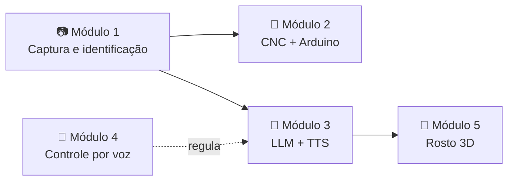

<div align="center">


**Um desenho à mão, reconhecido por visão computacional, explicado por uma IA e redesenhado por uma máquina CNC.**


[](https://github.com/Iago-Sepini/Desenha_AI)

</div>


## 📖 Sobre o projeto

O **Desenha AI** é um sistema que une visão computacional, inteligência artificial e automação física. Um desenho feito à mão no papel é capturado por uma câmera, que identifica o traço e reconhece do que se trata. A partir disso, uma inteligência artificial pesquisa sobre o objeto e responde **em voz** com informações relevantes: material, curiosidades e contexto.

Em paralelo, o mesmo desenho é reproduzido fisicamente por uma **máquina CNC**, que interpreta o traço e o redesenha de forma automatizada.

> ♻️ **Reaproveitamento:** a CNC usada no projeto estava parada e foi reaproveitada especificamente para esta aplicação, mostrando como equipamentos ociosos podem ganhar nova utilidade quando integrados a sistemas de inteligência artificial e visão computacional.

## 🎯 Aplicação prática

O principal objetivo é **auxiliar crianças em fase de aprendizado de escrita e desenho**, oferecendo um retorno imediato — **visual, físico e falado** — sobre aquilo que produzem. Ver o próprio traço sendo reconhecido e redesenhado por uma máquina reforça o aprendizado de forma lúdica e concreta.

## 🧩 Como funciona

O sistema é dividido em cinco módulos:

| # | Módulo | Descrição |
|---|--------|-----------|
| 1 | 📷 **Captura e identificação** | Câmera + OpenCV detectam o contorno do desenho no papel e o convertem para SVG. |
| 2 | 🤖 **Execução física** | O SVG é enviado a uma CNC controlada por Arduino, que redesenha o traço na máquina. |
| 3 | 🧠 **Pesquisa e fala** | O objeto identificado é enviado a uma LLM, que retorna um resumo; um TTS converte esse texto em voz. |
| 4 | 🎤 **Controle por voz** | Um microfone monitora comandos simples (*continuar* / *parar*) para controlar a fala em andamento. |
| 5 | 🙂 **Interface visual** | Um rosto 3D na tela reage ao estado da fala (falando/parado), servindo de interface com o visitante. |

### Fluxo geral



O Módulo 1 alimenta os Módulos 2 e 3 **em paralelo**; o Módulo 3 alimenta o Módulo 5; e o Módulo 4 regula o Módulo 3.

## 🔌 Arquitetura extensível

A identificação do desenho foi pensada para ser **independente da máquina**. A mesma identificação pode ser conectada a outras máquinas além da CNC, permitindo automatizar diferentes tipos de ação a partir do mesmo reconhecimento visual — abrindo espaço para aplicações futuras além do desenho em si.

## 🛠️ Tecnologias


<div align="center">


 
</div>

## 📁 Estrutura do repositório

```
desenha-ai/
├── vision/      # captura, contorno e conversão para SVG
├── ai/          # integração com a LLM e prompts
├── voice/       # TTS e comandos de voz
├── server/      # estado da fala e comunicação com o rosto 3D
├── hardware/    # firmware Arduino e envio de G-code
├── face3d/      # rosto 3D da interface
├── docs/        # imagens, vídeo demonstrativo e materiais
├── main.py
└── .env.example
```

## 🚀 Como executar

```bash
# 1. Clone o repositório
git clone https://github.com/Iago-Sepini/desenha-ai.git
cd desenha-ai

# 2. Instale as dependências
pip install -r requirements.txt

# 3. Configure as variáveis de ambiente
cp .env.example .env
# edite o .env e adicione sua chave da Groq

# 4. Execute
python main.py
```

## 📋 Requisitos
 
| Item | Função no projeto | Modelo |
|------|-------------------|--------|
| Câmera | Captura do desenho no papel | `[preencher]` |
| Microfone | Comandos de voz (*continuar* / *parar*) | `[preencher]` |
| Caixa de som | Saída da voz do assistente | `[preencher]` |
| Computador | Executa o sistema completo | `[preencher]` |
| Tela / monitor | Exibe o rosto 3D | `[preencher]` |
| Máquina CNC | Redesenha o traço no papel | `[preencher]` |
| Placa Arduino | Controla a CNC | `[preencher]` |
| Drivers de motor | Acionam os motores da CNC | `[preencher]` |
| Motores | Movimentam os eixos da CNC | `[preencher]` |
| Fonte de alimentação | Alimenta a CNC e os motores | `[preencher]` |
| Caneta e suporte | Traçam o desenho na CNC | `[preencher]` |

## 🎬 Demonstração

>
> `docs/demo.mp4`

## 👥 Equipe

Projeto desenvolvido por estudantes de Informática, divididos em três frentes:

### 💻 Software
| Nome |
|------|
| Iago Diniz Sepini Nunes |
| Vinicius Yuji Ozawa |
| Marcos Dias Sepini |
| Augusto Gonçalves Lemos |

### 🔧 Hardware
| Nome |
|------|
| Davi Vinagre Dias |
| Gustavo Porto Pereira |
| Mateus Gonçalves Tavares |

### 🎨 Design
| Nome |
|------|
| Higor Machado Miranda |
| João Gabriel Prado de Souza |
| Thales Silva Garcia |


## 🗺️ Roadmap

- [ ] Módulo 1 — captura, contorno e SVG
- [ ] Módulo 2 — CNC redesenhando o traço
- [ ] Módulo 3 — LLM + voz
- [ ] Módulo 4 — comandos *continuar* / *parar*
- [ ] Módulo 5 — rosto 3D reagindo à fala
- [ ] Integração completa dos módulos
- [ ] Suporte a outras máquinas além da CNC
